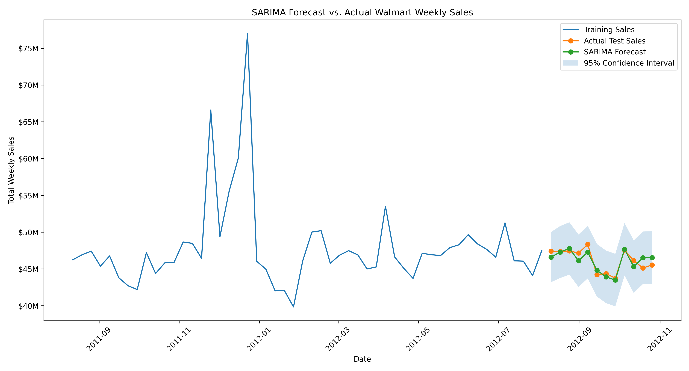

# Walmart Weekly Sales Forecasting and Trend Analysis

This project analyzes Walmart weekly sales data to identify long-term trends, seasonal behavior, holiday-driven demand, store-level differences, and forecasting performance. The analysis progresses from exploratory data analysis to nonseasonal ARIMA modeling and then to seasonal SARIMA modeling.

## Trend Analysis

Trend analysis was performed to understand Walmart weekly sales behavior before developing forecasting models. After converting the `Date` column into datetime format, additional time-based features were created, including `Year`, `Month`, `Month_Name`, and `Week_Of_Year`.

Sales were analyzed by week, month, holiday period, year, and store to identify recurring seasonal patterns, demand spikes, and differences in store performance.

### Monthly and Seasonal Patterns

The analysis showed that Walmart sales follow a noticeable seasonal pattern, with the strongest sales occurring during the holiday shopping period.

Across the store-level weekly observations:

- December had the highest average weekly sales at approximately **$1.28 million**.
- November had the second-highest average weekly sales at approximately **$1.15 million**.
- January had the lowest average weekly sales at approximately **$924,000**.

The sharp increase in November and December, followed by a decline in January, indicates a recurring holiday-driven sales cycle.

Holiday weeks also produced higher average weekly sales than non-holiday weeks. Many of the highest sales weeks occurred around Black Friday and Christmas, demonstrating the importance of holiday demand in Walmart's sales performance.

### Store-Level Differences

Average weekly sales varied significantly across stores. This indicates that sales patterns are influenced not only by seasonality and holiday periods, but also by differences in store size, location, customer demand, and overall store performance.

Because store-level behavior varies, the initial forecasting workflow focuses on total weekly sales across all stores. Individual-store forecasting can be evaluated separately in a later phase.

### Correlation Analysis

Correlation analysis was performed to measure the linear relationship between `Weekly_Sales` and the available external variables.

| Variable | Correlation with Weekly Sales |
|---|---:|
| Unemployment | -0.106 |
| CPI | -0.073 |
| Temperature | -0.064 |
| Holiday Flag | 0.037 |
| Fuel Price | 0.009 |

The external variables showed weak linear correlations with weekly sales.

Unemployment had the strongest negative correlation at approximately `-0.106`, while `Holiday_Flag` had a weak positive correlation of approximately `0.037`. These results suggest that no individual external variable strongly explains weekly sales by itself.

The weak correlation for `Holiday_Flag` does not mean that holidays are unimportant. Correlation measures only one overall linear relationship, while holiday effects are concentrated around specific events such as Black Friday and Christmas.

Overall, the exploratory analysis suggests that Walmart weekly sales are driven more strongly by recurring seasonality, holiday demand, and store-level differences than by any single external variable.

## Key Findings

- December had the highest average store-level weekly sales at approximately **$1.28 million**.
- January had the lowest average store-level weekly sales at approximately **$924,000**.
- Holiday weeks produced higher average sales than non-holiday weeks.
- Many of the highest sales weeks occurred around Black Friday and Christmas.
- Average weekly sales varied significantly across stores.
- December 2010 produced slightly higher total sales than December 2011 despite higher unemployment and lower CPI.
- The external variables had weak individual linear relationships with weekly sales.
- The recurring November and December increases followed by a January decline provide strong evidence of annual seasonality.

## ARIMA Model Identification

The store-level sales observations were aggregated by date to create a single weekly time series representing total Walmart sales across all stores.

The final 12 weeks were reserved as a holdout test set. All model identification and training were performed using the earlier observations to prevent information from the test period from influencing the model.

The Augmented Dickey-Fuller test was used to evaluate stationarity and suggested that nonseasonal differencing was not required:

```text
d = 0
```

ACF and PACF plots were then used to identify possible autoregressive and moving-average terms. Based on these diagnostics, two nonseasonal ARIMA candidates were evaluated:

- ARIMA `(1,0,1)`
- ARIMA `(1,0,2)`

## ARIMA Model Results

Both models were trained on the same training period and evaluated on the same 12-week holdout period using:

- Mean Absolute Error
- Root Mean Squared Error
- Mean Absolute Percentage Error
- Akaike Information Criterion
- Bayesian Information Criterion
- Ljung-Box residual test

| Model | MAE | RMSE | MAPE | AIC | BIC | Ljung-Box p-value |
|---|---:|---:|---:|---:|---:|---:|
| ARIMA `(1,0,1)` | $1,378,933 | $1,796,535 | 3.06% | 4435.67 | 4447.17 | < 0.01 |
| ARIMA `(1,0,2)` | $1,588,545 | $1,892,971 | 3.51% | 4426.04 | 4440.42 | 0.02 |

ARIMA `(1,0,1)` produced the strongest out-of-sample forecasting performance. Its forecasts were approximately **3.06% away from actual weekly sales on average**, and it achieved lower MAE and RMSE than ARIMA `(1,0,2)`.

Although ARIMA `(1,0,2)` produced lower AIC and BIC values, indicating a better fit to the training data after accounting for model complexity, it performed worse on the unseen test period.

Because the primary objective of the project is forecasting future sales, out-of-sample MAE, RMSE, and MAPE were prioritized over training fit.

## ARIMA Limitations

The ARIMA `(1,0,1)` forecasts gradually converged toward approximately **$47.2 million in total weekly sales**. This resulted in a relatively flat forecast that did not capture several sharp increases and decreases in the test period.

The Ljung-Box p-values for both models were below the `0.05` threshold. This indicates that statistically significant autocorrelation remained in the residuals at the tested lag.

In other words, the ARIMA models left predictable time-series structure unexplained.

This result is consistent with the earlier trend analysis. Walmart sales contain recurring holiday and annual patterns, while a standard ARIMA model only represents nonseasonal autoregressive, differencing, and moving-average relationships.

Therefore, ARIMA `(1,0,1)` was retained as the strongest **nonseasonal baseline model**, but it was not considered the final forecasting solution.

## SARIMA Model Identification

SARIMA was evaluated to capture the recurring yearly behavior that the nonseasonal ARIMA models could not represent.

SARIMA extends ARIMA by adding seasonal parameters:

```text
SARIMA(p, d, q) x (P, D, Q, s)
```

Because the dataset contains weekly observations and the sales pattern repeats annually, the seasonal period was set to:

```text
s = 52
```

The nonseasonal and seasonal differencing terms remained at zero because the training series did not require additional regular or seasonal differencing:

```text
d = 0
D = 0
```

The following candidate models were trained and evaluated on the same 12-week holdout period used for ARIMA:

- SARIMA `(1,0,1) x (1,0,0,52)`
- SARIMA `(1,0,1) x (0,0,1,52)`
- SARIMA `(1,0,2) x (1,0,0,52)`
- SARIMA `(2,0,1) x (1,0,0,52)`

## SARIMA Model Results

| Model | MAE | RMSE | MAPE | AIC | BIC | Ljung-Box p-value | Converged |
|---|---:|---:|---:|---:|---:|---:|:---:|
| SARIMA `(1,0,1) x (1,0,0,52)` | **$657,878** | **$773,578** | **1.43%** | 317.62 | 329.40 | 0.5076 | Yes |
| SARIMA `(1,0,1) x (0,0,1,52)` | $791,020 | $914,409 | 1.73% | 458.48 | 470.20 | 0.0275 | Yes |
| SARIMA `(1,0,2) x (1,0,0,52)` | $833,066 | $1,088,442 | 1.82% | 311.82 | 325.96 | 0.7267 | Yes |
| SARIMA `(2,0,1) x (1,0,0,52)` | $838,253 | $1,094,020 | 1.83% | 308.93 | 322.99 | 0.5854 | Yes |

SARIMA `(1,0,1) x (1,0,0,52)` was selected as the best model because it produced the lowest out-of-sample MAE, RMSE, and MAPE.

Its forecasts were approximately **1.43% away from actual total weekly sales on average**. The model also achieved a Ljung-Box p-value of `0.5076`, which is above the `0.05` significance threshold. This indicates that no statistically significant residual autocorrelation was detected at the tested lag.

All four candidate models converged successfully. However, SARIMA `(1,0,1) x (0,0,1,52)` generated a warning because the training data contained too few complete seasonal cycles to reliably estimate the initial seasonal moving-average parameters. That model also retained significant residual autocorrelation and performed worse on the holdout period.

Although SARIMA `(2,0,1) x (1,0,0,52)` produced the lowest AIC and BIC, it had substantially worse test RMSE than the selected model. This reinforces the decision to prioritize forecasting performance on unseen data over training-fit criteria alone.

## SARIMA Forecast vs. Actual Sales

The selected SARIMA model followed the week-to-week movement of the holdout data more closely than the ARIMA baseline. The forecast captured several rises and declines in the test period instead of converging toward a nearly flat long-term value.

The shaded region represents the model's 95% forecast confidence interval. All actual test observations shown in the holdout period fell within their corresponding confidence intervals.



## ARIMA vs. SARIMA Performance

| Metric | Best ARIMA | Best SARIMA | Improvement |
|---|---:|---:|---:|
| MAE | $1,378,933 | **$657,878** | **52.3% lower** |
| RMSE | $1,796,535 | **$773,578** | **56.9% lower** |
| MAPE | 3.06% | **1.43%** | **53.3% lower** |
| Ljung-Box p-value | < 0.01 | **0.5076** | Residual autocorrelation removed |

The SARIMA model reduced RMSE by approximately **56.9%** compared with the best ARIMA model. This is a substantial improvement and demonstrates that annual seasonality is an important source of predictive information in Walmart weekly sales.

The improved residual diagnostics also show that the seasonal model captured time-dependent structure that remained unexplained by ARIMA.

## Final Model

The final selected forecasting configuration is:

```text
SARIMA(1,0,1) x (1,0,0,52)
```

The model combines:

- One nonseasonal autoregressive term
- One nonseasonal moving-average term
- One seasonal autoregressive term
- A 52-week annual seasonal period

This configuration uses recent weekly sales behavior, recent forecast errors, and sales behavior from approximately the same period one year earlier.

## Conclusion

The project demonstrates that Walmart weekly sales contain strong annual and holiday-related seasonality. Exploratory analysis identified recurring increases during November and December, followed by lower sales in January. Standard ARIMA models provided a useful nonseasonal baseline but produced relatively flat forecasts and left significant residual autocorrelation unexplained.

Adding a 52-week seasonal component substantially improved forecasting accuracy. SARIMA `(1,0,1) x (1,0,0,52)` achieved an MAE of approximately **$657,878**, an RMSE of approximately **$773,578**, and a MAPE of **1.43%** on the 12-week holdout period.

These results show that explicitly modeling annual seasonality provides a more accurate representation of Walmart's weekly demand patterns than a nonseasonal ARIMA model.

## Future Work

Future extensions of the project may include:

- Refit the selected SARIMA model on the complete dataset and forecast future weekly sales.
- Compare SARIMA with seasonal-naive and other baseline forecasts.
- Add external regressors such as holiday indicators, CPI, unemployment, temperature, and fuel price through SARIMAX.
- Use rolling-origin cross-validation to evaluate model stability across multiple forecast windows.
- Build and compare separate forecasting models for individual Walmart stores.
- Create an interactive Power BI dashboard for trends, model performance, and future forecasts.
